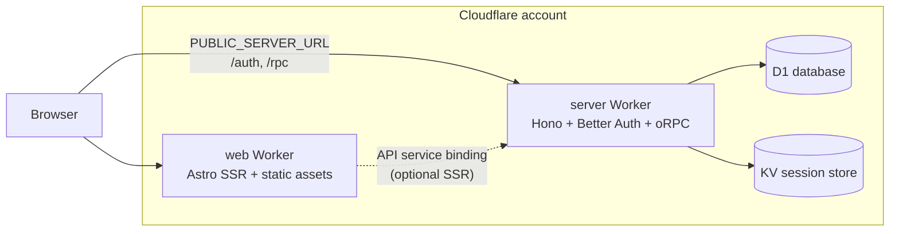

# Deploy Cornwall Ponds to Cloudflare

## Short answer: Pages + manual Worker is not the path this repo uses

| Question                                       | Answer for this repo                                                                                                                                                                                                           |
| ---------------------------------------------- | ------------------------------------------------------------------------------------------------------------------------------------------------------------------------------------------------------------------------------ |
| Deploy Hono (`apps/server`) to a Worker?       | **Yes** — required for D1, KV, Better Auth, and edge runtime.                                                                                                                                                                  |
| Deploy Astro (`apps/web`) to Cloudflare Pages? | **Not as a separate Pages project.** Use the existing **Alchemy `Astro` resource**, which deploys SSR Astro as a **Worker + `dist/client` assets** (same operational model as Pages with Functions, but managed in one stack). |
| Best option?                                   | **`pnpm run deploy`** from the monorepo root, which runs Alchemy in [`packages/infra`](../../packages/infra).                                                                                                                        |

Manual “connect Pages to Git + wrangler.toml for API” would duplicate what [`packages/infra/alchemy.run.ts`](../../packages/infra/alchemy.run.ts) already defines (two Workers, D1, KV, bindings, migrations, secrets).



---

## What is already wired

Infrastructure is defined in [`packages/infra/alchemy.run.ts`](../../packages/infra/alchemy.run.ts):

- **`server`** — `Worker` from `apps/server` (`src/index.ts`, `compatibility: "node"`), with D1, session KV, auth secrets, CORS, Resend/Google when set.
- **`web`** — `Astro` from `apps/web` (`entrypoint: dist/server/entry.mjs`, `assets: dist/client`), with `PUBLIC_SERVER_URL` and a **service binding** `API: server` for worker-to-worker calls.

Alchemy loads env by mode: `.env.development` for `alchemy dev`, `.env.production` for `alchemy deploy` (see `loadAppEnv` in `alchemy.run.ts`).

Astro is configured for Cloudflare when Alchemy dev/deploy has generated local Wrangler config:

```28:30:apps/web/astro.config.mjs
  adapter: shouldUseAlchemy
    ? alchemy({ platformProxy: { configPath: alchemyConfigPath } })
    : node({ mode: "standalone" }),
```

With `output: "server"`, a static-only Pages deploy would **not** match this app without changing architecture.

Client/browser traffic today uses the public API URL (not the service binding):

- [`apps/web/src/lib/orpc.ts`](../../apps/web/src/lib/orpc.ts) → `PUBLIC_SERVER_URL`
- [`apps/web/src/lib/auth-client.ts`](../../apps/web/src/lib/auth-client.ts) → `PUBLIC_SERVER_URL`

The `API` binding is provisioned for future SSR/internal use ([`packages/env/src/web-worker.ts`](../../packages/env/src/web-worker.ts)).

**Important:** `PUBLIC_SERVER_URL` is inlined into client JS at **build time**. Updating only the Cloudflare dashboard after deploy will not fix browser requests still pointing at `localhost`. Redeploy with correct `.env.production` values.

**Alchemy + `.env.development`:** On `alchemy deploy`, Alchemy injects `apps/web/.env.development` before `alchemy.run.ts` runs. [`packages/infra/alchemy.run.ts`](../../packages/infra/alchemy.run.ts) loads `.env.production` with `override: true` and passes `PUBLIC_*` into the Astro build `env` so client bundles get production URLs, not localhost.

---

## Prerequisites

1. **Cloudflare account** with Workers, D1, and KV enabled.
2. **API token** with permissions to manage Workers, D1, and KV (same vars as devcontainer):
   - `CLOUDFLARE_ACCOUNT_ID`
   - `CLOUDFLARE_API_TOKEN`
3. **`ALCHEMY_PASSWORD`** — encrypts `alchemy.secret.env.*` in Alchemy state; must be the **same** everywhere you deploy (local, CI, teammates). Generate once: `openssl rand -base64 32`.
4. **Node ≥22.12** (project targets v24) and **pnpm** on the machine that runs deploy.

Copy and fill env files (see [`packages/infra/.env.example`](../../packages/infra/.env.example)):

| File | Purpose |
| ---- | ------- |
| [`packages/infra/.env`](../../packages/infra/.env) | `ALCHEMY_PASSWORD`, Cloudflare credentials |
| [`apps/server/.env`](../../apps/server/.env) | Secrets (auth, OAuth, Resend) |
| [`apps/server/.env.development`](../../apps/server/.env.development) | Local auth/CORS URLs |
| [`apps/server/.env.production`](../../apps/server/.env.production) | Production auth/CORS URLs |
| [`apps/web/.env.development`](../../apps/web/.env.development) | Local `PUBLIC_SERVER_URL` |
| [`apps/web/.env.production`](../../apps/web/.env.production) | Production `PUBLIC_SERVER_URL` |

---

## Deploy steps (recommended)

Run from repo root on your machine (Node v24):

```bash
node -v   # expect v24.x
pnpm install
pnpm run deploy
```

Equivalent: `cd packages/infra && pnpm run deploy`.

**First deploy:** Alchemy creates/updates Workers, D1, KV, applies migrations from [`packages/db/src/migrations`](../../packages/db/src/migrations), and prints URLs:

```
Web    -> https://...
Server -> https://...
```

**Second pass (required for auth/CORS):** Put deployed URLs in `.env.production` files, then deploy again:

```bash
# apps/web/.env.production
PUBLIC_SERVER_URL=https://<your-server-worker-url>

# apps/server/.env.production
BETTER_AUTH_URL=https://<your-server-worker-url>
CORS_ORIGIN=https://<your-web-worker-url>
WEB_URL=https://<your-web-worker-url>
```

`CORS_ORIGIN` and `WEB_URL` must match the web origin exactly ([`packages/auth/src/options.ts`](../../packages/auth/src/options.ts) `trustedOrigins`). Use origins **without** a trailing slash (e.g. `https://…workers.dev`, not `…workers.dev/`). Cookies are already set for cross-origin (`sameSite: "none"`, `secure: true`).

### Cloudflare dashboard vs Alchemy

- **Source of truth:** `pnpm run deploy` reads [`apps/web/.env.production`](../../apps/web/.env.production) and [`apps/server/.env.production`](../../apps/server/.env.production) and pushes bindings via [`packages/infra/alchemy.run.ts`](../../packages/infra/alchemy.run.ts). Manual dashboard edits can be overwritten on the next deploy.
- **Client `PUBLIC_*` vars:** Dashboard values on the **web** worker do **not** update JS already built into `dist/client/`. You must redeploy after changing `apps/web/.env.production`.
- **Align with `.env.production`:** e.g. `CF_ACCESS_ENABLED=false` on the server worker when not validating Access JWTs on the API; strip trailing slashes from `CORS_ORIGIN` / `WEB_URL` if you set them in the dashboard by hand.

**Optional — production stage:**

```bash
pnpm run deploy -- --stage prod
```

Use stage-specific `.env` files (see [Better-T-Stack Cloudflare + Alchemy guide](https://www.better-t-stack.dev/docs/guides/cloudflare-alchemy)).

**Optional — custom domains:** Extend `alchemy.run.ts` with `domains` on `Worker` / `Astro` when `app.stage === "prod"` (documented in the same guide).

**Teardown:** `pnpm run destroy` (destructive; removes Workers/D1 for that stage unless configured otherwise).

---

## Local dev (same stack, no deploy)

```bash
pnpm run dev
```

Runs `alchemy dev` in [`packages/infra`](../../packages/infra): Miniflare-backed D1/KV, web on **4321**, API on **3000** ([README](../../README.md)). Alchemy writes `apps/web/.alchemy/local/wrangler.jsonc` so Astro switches to the Cloudflare adapter.

---

## Production checklist

- [ ] Set `BETTER_AUTH_SECRET` via `alchemy.secret.env` (never commit).
- [ ] Set production URLs in `apps/web/.env.production` and `apps/server/.env.production`; redeploy.
- [ ] Configure Google OAuth redirect URIs and Resend sender for production domains.
- [ ] If web and API share only `*.workers.dev` (different subdomains), consider enabling `crossSubDomainCookies` in [`packages/auth/src/options.ts`](../../packages/auth/src/options.ts) (commented template); prefer a **shared parent domain** long term.
- [ ] For CI: set `ALCHEMY_PASSWORD`, Cloudflare token, and env secrets in GitHub Actions; configure a [remote Alchemy state store](https://alchemy.run/guides/cloudflare-state-store/) if you do not commit encrypted `.alchemy` state.
- [ ] Remote schema push (optional): `CLOUDFLARE_DATABASE_ID` + token for `pnpm run db:push` ([`packages/db/drizzle.config.ts`](../../packages/db/drizzle.config.ts)); deploy already runs D1 migrations via Alchemy.

---

## When you would use Cloudflare Pages instead

Only if you intentionally **change** the frontend to static or a Pages-first workflow (e.g. `output: "static"` or a separate Pages Git integration) **and** drop Alchemy’s `Astro` resource. That would forfeit the current service binding, shared IaC, and typed bindings in [`packages/env/env.d.ts`](../../packages/env/env.d.ts). For this SSR + API + D1 stack, **Workers via Alchemy is the intended and simpler path.**

---

## Reference

- In-repo: [README — Deployment](../../README.md)
- Upstream: [Deploying to Cloudflare with Alchemy](https://www.better-t-stack.dev/docs/guides/cloudflare-alchemy)
- Alchemy: [CI/CD](https://alchemy.run/guides/ci/), [state store](https://alchemy.run/guides/cloudflare-state-store/)
