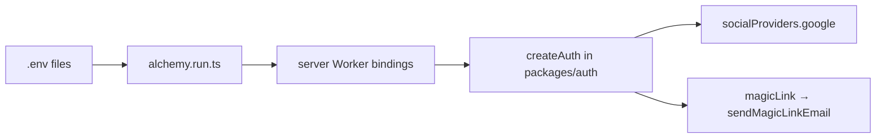

# Configure Google OAuth and Resend env

## WHERE TO SAVE EACH VALUE (read this first)

**Google OAuth and Resend credentials go in one file:**

### [`apps/server/.env`](../../apps/server/.env)

Example (replace placeholders):

```env
# Secrets — keep in .env (not committed)
BETTER_AUTH_SECRET=...
GOOGLE_CLIENT_ID=123456789-xxxx.apps.googleusercontent.com
GOOGLE_CLIENT_SECRET=GOCSPX-xxxxxxxx
RESEND_API_KEY=re_xxxxxxxx
RESEND_FROM_EMAIL=Auth <auth@yourdomain.com>
```

**URLs** — use mode-specific files (loaded by Alchemy):

| Variable | Local file | Production file |
| -------- | ---------- | ----------------- |
| `BETTER_AUTH_URL`, `CORS_ORIGIN`, `WEB_URL` | `apps/server/.env.development` | `apps/server/.env.production` |
| `PUBLIC_SERVER_URL` | `apps/web/.env.development` | `apps/web/.env.production` |

| Secret / variable | Save in | Do NOT save in |
| ----------------- | ------- | -------------- |
| `GOOGLE_CLIENT_ID` | **`apps/server/.env`** | `apps/web/.env`, `packages/infra/.env` |
| `GOOGLE_CLIENT_SECRET` | **`apps/server/.env`** | same |
| `RESEND_API_KEY` | **`apps/server/.env`** | same |
| `RESEND_FROM_EMAIL` | **`apps/server/.env`** | same |
| `BETTER_AUTH_SECRET` | **`apps/server/.env`** | same |
| `ALCHEMY_PASSWORD` | **`packages/infra/.env`** only | — |
| `CLOUDFLARE_*` | **`packages/infra/.env`** only | — |

**Why:** [`packages/infra/alchemy.run.ts`](../../packages/infra/alchemy.run.ts) loads these into the **server** Worker. The Astro app never receives `GOOGLE_CLIENT_SECRET` or `RESEND_API_KEY`.

**After editing:** restart Alchemy:

```bash
pnpm --filter @cornwall-ponds/infra dev
```

**Never commit** real secrets.

---

## How it fits together



| Variable               | Alchemy binding                                                    | Secret? | Required for                           |
| ---------------------- | ------------------------------------------------------------------ | ------- | -------------------------------------- |
| `GOOGLE_CLIENT_ID`     | `alchemy.env` (when set in process.env at Alchemy run)             | No      | Google OAuth                           |
| `GOOGLE_CLIENT_SECRET` | `alchemy.secret.env` (conditional)                                 | Yes     | Google OAuth                           |
| `RESEND_API_KEY`       | `alchemy.secret.env` (conditional)                                 | Yes     | Magic-link email                       |
| `RESEND_FROM_EMAIL`    | `alchemy.env` (when set)                                           | No      | Sender address (optional; has default) |

Runtime behavior in [`packages/auth/src/options.ts`](../../packages/auth/src/options.ts):

- **Google** is enabled only when **both** `GOOGLE_CLIENT_ID` and `GOOGLE_CLIENT_SECRET` are present.
- **Email** uses the `magicLink` plugin; [`packages/auth/src/resend.ts`](../../packages/auth/src/resend.ts) throws if `RESEND_API_KEY` is missing.

The login UI ([`apps/web/src/components/login-form.tsx`](../../apps/web/src/components/login-form.tsx)) may still be a mock — env alone does not wire “Login with Google” until the form calls Better Auth.

---

## Step 1 — Prerequisite auth URLs

**Local** (`apps/server/.env.development`):

| Variable             | Value                   |
| -------------------- | ----------------------- |
| `BETTER_AUTH_URL`    | `http://localhost:3000` |
| `CORS_ORIGIN`        | `http://localhost:4321` |
| `WEB_URL`            | `http://localhost:4321` |

**Local** (`apps/web/.env.development`): `PUBLIC_SERVER_URL=http://localhost:3000`

**Production:** set matching URLs in `.env.production` files to your deployed Worker URLs or custom domains.

---

## Step 2 — Google OAuth credentials

### 2a — Google Cloud Console

1. [Google Cloud Console](https://console.cloud.google.com/) → Credentials → OAuth client ID → **Web application**.
2. **Authorized redirect URIs:**
   - Local: `http://localhost:3000/api/auth/callback/google`
   - Production: `https://<your-api-host>/api/auth/callback/google`
3. **Authorized JavaScript origins:**
   - Local: `http://localhost:4321`
   - Production: `https://<your-web-host>`

### 2b — Add to `apps/server/.env`

```env
GOOGLE_CLIENT_ID=<from Google Console>
GOOGLE_CLIENT_SECRET=<from Google Console>
```

`GOOGLE_CLIENT_SECRET` is only bound when set in `process.env` **when Alchemy runs** (`dev` or `deploy`).

---

## Step 3 — Resend for magic-link email

### 3a — Resend dashboard

1. Create API key.
2. Verify domain for production `RESEND_FROM_EMAIL`.
3. Local: optional `RESEND_FROM_EMAIL`; default onboarding sender in code.

### 3b — Add to `apps/server/.env`

```env
RESEND_API_KEY=re_...
RESEND_FROM_EMAIL=Auth <auth@yourdomain.com>
```

---

## Step 4 — Alchemy secrets encryption

[`packages/infra/.env`](../../packages/infra/.env):

```env
ALCHEMY_PASSWORD=<stable secret>
```

Same password on every machine/CI that deploys.

Conditional secret bindings in `alchemy.run.ts`:

```typescript
const serverSecretBindings = {
  ...(process.env.GOOGLE_CLIENT_SECRET
    ? { GOOGLE_CLIENT_SECRET: alchemy.secret.env.GOOGLE_CLIENT_SECRET }
    : {}),
  ...(process.env.RESEND_API_KEY
    ? { RESEND_API_KEY: alchemy.secret.env.RESEND_API_KEY }
    : {}),
};
```

---

## Step 5 — Apply changes

```bash
pnpm --filter @cornwall-ponds/infra dev
```

Restart after editing `.env` so bindings refresh.

---

## Verification checklist

| Check        | How                                                                 |
| ------------ | ------------------------------------------------------------------- |
| Bindings     | After `infra dev`, server worker includes Google/Resend when set    |
| Auth health  | `GET http://localhost:3000/api/auth/ok` → `{ "status": "ok" }`      |
| Google       | `signIn.social({ provider: "google" })` when both Google vars set   |
| Resend       | Magic link send; or `RESEND_API_KEY is not configured` if missing   |

---

## Production deploy notes

1. Separate Google OAuth redirect URIs for production.
2. Verified `RESEND_FROM_EMAIL` on your domain.
3. Production secrets in `apps/server/.env`; production URLs in `.env.production` files.
4. `pnpm run deploy` — do not rely on dashboard-only env edits for `PUBLIC_SERVER_URL` (client bundle is build-time).

No code changes required for env wiring unless connecting the login form — see [resend-magic-link-setup.md](./resend-magic-link-setup.md).
