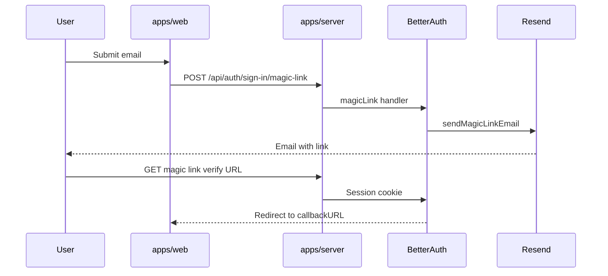

# Resend + Better Auth magic link (dev & production)

## Current state

Much of the backend is already in place:

| Layer                          | Status                                                                                                                                                                                                |
| ------------------------------ | ----------------------------------------------------------------------------------------------------------------------------------------------------------------------------------------------------- |
| Better Auth `magicLink` plugin | Configured in [`packages/auth/src/options.ts`](../../packages/auth/src/options.ts) with `sendMagicLink` → [`packages/auth/src/resend.ts`](../../packages/auth/src/resend.ts)                                      |
| Worker bindings                | [`packages/infra/alchemy.run.ts`](../../packages/infra/alchemy.run.ts) passes `RESEND_FROM_EMAIL` and conditionally `RESEND_API_KEY` (secret)                                                               |
| Env placeholders               | Documented in [`apps/server/.env.example`](../../apps/server/.env.example); URLs in `.env.development` / `.env.production`                                                                       |
| Resend delivery                | **Raw `fetch`** to `api.resend.com` (not the official SDK yet)                                                                                                                                        |
| Web client / UI                | **Not wired** — [`apps/web/src/lib/auth-client.ts`](../../apps/web/src/lib/auth-client.ts) has no `magicLinkClient`; [`login-form.tsx`](../../apps/web/src/components/login-form.tsx) still shows password fields |



---

## Part A — Human setup (Resend dashboard)

Do this once in [Resend](https://resend.com):

1. **API key** → store as `RESEND_API_KEY` (never commit; in `apps/server/.env`).
2. **Development sending**
   - You may omit `RESEND_FROM_EMAIL` locally; code falls back to `Auth <onboarding@resend.dev>` ([`packages/auth/src/resend.ts`](../../packages/auth/src/resend.ts)).
   - For safe testing, send to Resend test inboxes (`delivered@resend.dev`, etc.) per their docs — not fake random addresses.
3. **Production**
   - Verify your domain at [resend.com/domains](https://resend.com/domains).
   - Set `RESEND_FROM_EMAIL` to a verified sender, e.g. `Cornwall Ponds <auth@yourdomain.com>` — **do not** use `onboarding@resend.dev` in production.

---

## Part B — Environment variables (you configure; agent documents)

Alchemy loads env from infra + apps (see [`packages/infra/alchemy.run.ts`](../../packages/infra/alchemy.run.ts) `loadAppEnv`):

- [`packages/infra/.env`](../../packages/infra/.env)
- [`apps/web/.env`](../../apps/web/.env) + `.env.development` / `.env.production`
- [`apps/server/.env`](../../apps/server/.env) + `.env.development` / `.env.production`

### Development

In `apps/server/.env`:

```env
RESEND_API_KEY=re_...
# Optional locally; omit to use Resend test sender:
# RESEND_FROM_EMAIL=Auth <onboarding@resend.dev>
```

URLs in `apps/server/.env.development` and `apps/web/.env.development` (localhost ports).

Restart dev after changes.

**You run (from repo root, Node v24):**

```bash
node -v
pnpm install
pnpm run dev
```

### Production (before `pnpm run deploy`)

| Variable                                 | Production value                                                                      |
| ---------------------------------------- | ------------------------------------------------------------------------------------- |
| `RESEND_API_KEY`                         | Production Resend API key (in `apps/server/.env`; bound as secret on deploy) |
| `RESEND_FROM_EMAIL`                      | Verified domain sender                                                                |
| `BETTER_AUTH_URL`                        | In `apps/server/.env.production`                                                      |
| `CORS_ORIGIN` / `WEB_URL`                | In `apps/server/.env.production`                                                      |
| `PUBLIC_SERVER_URL`                      | In `apps/web/.env.production`                                                         |

`RESEND_API_KEY` is only bound when `process.env.RESEND_API_KEY` is set during Alchemy run; without it, magic-link send throws `"RESEND_API_KEY is not configured"`.

**You run for deploy:**

```bash
pnpm run deploy
```

Ensure `ALCHEMY_PASSWORD` and Cloudflare tokens are set (see [`.devcontainer/devcontainer.json`](../../.devcontainer/devcontainer.json)).

---

## Part C — Where Resend Cloudflare Workers code goes (Hono + Better Auth + oRPC)

The [Resend Cloudflare Workers guide](https://resend.com/docs/send-with-cloudflare-workers) shows a **standalone** worker with `export default { async fetch(...) }`. **Do not paste that into this repo.** Your server already exports a Hono app from [`apps/server/src/index.ts`](../../apps/server/src/index.ts); Alchemy wraps it as the Worker entrypoint.

| Resend doc snippet                      | In this monorepo                                                                                                         |
| --------------------------------------- | ------------------------------------------------------------------------------------------------------------------------ |
| `export default { async fetch(...) }`   | **Skip** — already handled by Hono `export default app`                                                                  |
| `new Resend('re_xxx')` hardcoded        | **Never** — use `env.RESEND_API_KEY` from Worker bindings via `c.env` → `createAuth({ env: c.env })`                     |
| `return Response.json(data)` demo route | **Skip** — no dedicated `/send-email` route unless you want one for debugging                                            |
| `EmailTemplate` in `src/emails/`        | **Yes** — colocate with the sender in `packages/auth`                                                                    |
| `resend.emails.send({ react: ... })`    | **Yes** — inside [`packages/auth/src/resend.ts`](../../packages/auth/src/resend.ts)                                      |

**oRPC** does not send email. **Better Auth** owns the trigger via `POST /api/auth/sign-in/magic-link`.

### File layout (recommended)

```
packages/auth/
  src/
    options.ts
    resend.ts
    emails/
      magic-link.tsx
```

**Remove or relocate** any template under `apps/server/src/` — wrong dependency direction.

---

## Part D — Code changes

### 1. Install dependencies

```bash
pnpm --filter @cornwall-ponds/auth add resend react
pnpm --filter @cornwall-ponds/auth add -D @types/react
```

### 2. Resend SDK + React template in auth package

See conceptual implementation in original plan (Part C in Cursor export).

### 3. Better Auth client — [`apps/web/src/lib/auth-client.ts`](../../apps/web/src/lib/auth-client.ts)

```ts
import { magicLinkClient } from "better-auth/client/plugins";

export const authClient = createAuthClient({
  baseURL: PUBLIC_SERVER_URL,
  plugins: [magicLinkClient()],
});
```

### 4. Magic-link UI

Update [`login-form.tsx`](../../apps/web/src/components/login-form.tsx) and [`signup-form.tsx`](../../apps/web/src/components/signup-form.tsx): email-only, `signIn.magicLink`, client island with `// Why:` comment.

---

## Part E — Verification checklist

1. Set `RESEND_API_KEY` in `apps/server/.env`, restart `pnpm run dev`.
2. Open `http://localhost:4321/login`, submit email (`delivered@resend.dev` for safe test).
3. Confirm Resend dashboard; click link; session on `/dashboard`.
4. Production: deploy with verified sender and production URL env files.

**Debug:** `GET http://localhost:3000/api/auth/ok`, `GET http://localhost:3000/health`

---

## Out of scope

- Dedicated `/send-test-email` route
- `@react-email/components` (optional later)
- Password-reset / email verification flows
