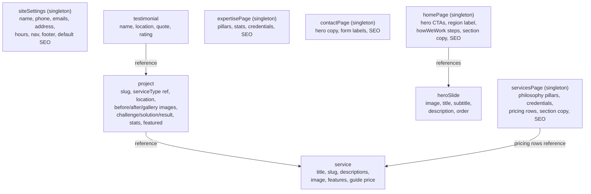

# Sanity.io Content Migration Plan

**Overview:** Migrate all marketing content (projects, services, testimonials, hero, page copy, business info) from hardcoded TypeScript/Astro files to Sanity.io, with a portable schema + seed kit for a separate Studio repo and a typed GROQ data layer in the Astro app.

## How Sanity fits this site

Sanity has two halves:

1. **The Studio** — a React editing UI you configure with _schemas_ (TypeScript files describing your content types). The Studio lives in a separate repo, so this monorepo will produce a portable `sanity-kit/` folder you copy into a fresh `npm create sanity@latest` project.
2. **The Content Lake** — Sanity's hosted database. The Astro app queries it at request time with **GROQ** (Sanity's query language) via `@sanity/client`. Reads on a public dataset need no token and hit Sanity's CDN, which suits the Cloudflare Workers SSR setup.

Today every content entity is hardcoded — mostly in [apps/web/src/lib/projects.ts](../apps/web/src/lib/projects.ts) and [apps/web/src/lib/hero-slides.ts](../apps/web/src/lib/hero-slides.ts), plus inline arrays in [apps/web/src/pages/services.astro](../apps/web/src/pages/services.astro) and [apps/web/src/pages/expertise.astro](../apps/web/src/pages/expertise.astro). The migration replaces those with GROQ fetches in each page's frontmatter. Operational data (auth, customer portal, D1/R2) stays exactly where it is.

## Content model design

Two kinds of documents, which is the key to a user-friendly Studio:

- **Repeatable documents** (lists the editor adds to): `project`, `service`, `testimonial`, `heroSlide`
- **Singletons** (one fixed document per page/site): `siteSettings`, `homePage`, `servicesPage`, `expertisePage`, `ourWorkPage`, `contactPage`, `legalPage` (x2 for privacy/terms)

Per-page singletons with explicit fields beat a generic "page builder" for a small marketing site — editors see exactly the fields each page needs, and the frontend stays simple.

Design decisions worth noting:

- **`project.serviceType` becomes a reference to `service`** instead of a string enum — single source of truth, and renaming a service updates everywhere. Keep `location` as a string list (`options.list`) since locations have no other fields.
- **Pricing rows live on `servicesPage`** but each row references a `service` — price is page copy, the service is the entity.
- **Shared objects** (defined once, reused): `seo` (title, description), `cta` (label, href, tone), `credential`, `pillar`, `stat`, `processStep`, `imageWithAlt`.
- **Long-form fields** (`challenge`/`solution`/`result`, legal pages) use Portable Text (Sanity's rich text); short copy stays `string`/`text`.
- This also fixes the audited copy inconsistencies (15 vs 30 years, `hello@` vs `info@`) by giving each fact exactly one home in `siteSettings`/`expertisePage`.

## Implementation

### 1. Portable Studio kit — new `sanity-kit/` folder in this repo

- `schemaTypes/` — all document + object schemas above, with `defineType`/`defineField`, validation (required titles, slug uniqueness), and `preview` configs so lists look good in the Studio.
- `structure.ts` — custom desk structure: singletons pinned at top ("Site Settings", "Pages"), then "Projects", "Services", "Testimonials", "Hero Slides". This is what makes the Studio user-friendly.
- `README.md` — exact steps: `npm create sanity@latest` in a new repo, copy these files in, run `sanity dev`.

### 2. Seed content

- `sanity-kit/seed/seed.ndjson` generated from the existing data in `projects.ts`, `hero-slides.ts`, `hero-content.ts`, and the inline arrays — importable with `sanity dataset import seed.ndjson production`.
- **Images caveat:** the repo contains no image files (only `/images/*.jpg` path strings; `public/images/` doesn't exist). Seed documents will have empty image fields; you upload the real images through the Studio after import. If the image files become available, the seed can be upgraded to bundle them.

### 3. Astro app wiring

- Add `@sanity/client` + `@sanity/image-url` to `apps/web`.
- New `apps/web/src/lib/sanity/client.ts` (`useCdn: true`, `apiVersion` pinned), `image.ts` (URL builder for responsive images), and `queries.ts` (one typed GROQ query per page + interfaces matching the schemas — replacing the types currently in `projects.ts`).
- Env vars `PUBLIC_SANITY_PROJECT_ID` / `PUBLIC_SANITY_DATASET`: add to the `env.schema` in [apps/web/astro.config.mjs](../apps/web/astro.config.mjs), to [packages/env/src/web.ts](../packages/env/src/web.ts), and to the web worker bindings in [packages/infra/alchemy.run.ts](../packages/infra/alchemy.run.ts).

### 4. Refactor pages and components (page by page)

- `index.astro` — fetch `homePage` + slides + featured projects + testimonials; pass into `Hero`, `ServicesPreview`, `BeforeAfter`, `HowWeWork`, `TestimonialsSection`.
- `services.astro` — fetch `servicesPage` + all services; replaces inline `guidePrices[]`/`credentials[]`.
- `expertise.astro` — fetch `expertisePage`.
- `our-work/index.astro` + `[slug].astro` — fetch projects list / single project by slug; portfolio filter island receives Sanity-derived service types + locations.
- `contact.astro` — fetch `contactPage` + contact details from `siteSettings`.
- `Layout.astro` / `Footer.astro` / nav — fetch `siteSettings` for SEO defaults, contact info, nav links.
- New `/privacy` and `/terms` pages rendering `legalPage` Portable Text (fixes existing dead footer links).
- Components keep typed `Props`; only the data source changes from imports to fetched props.

### 5. Cleanup and verify

- Delete `projects.ts` data arrays, `hero-slides.ts`, `hero-content.ts` content, and the orphaned `lib/testimonials.ts` once nothing imports them (types move to `lib/sanity/`).
- Verification commands (run in your terminal, not the agent sandbox): `pnpm --filter web exec astro check` and `pnpm --filter web build`, plus `pnpm dev` to browse all routes against the seeded dataset.

## What happens outside this repo

1. Create a free Sanity project at sanity.io/manage (note the project ID; dataset `production`, public).
2. `npm create sanity@latest` in a new repo, copy `sanity-kit/` files in.
3. `sanity dataset import seed/seed.ndjson production`, then upload images via the Studio.
4. Add the project ID/dataset to `apps/web/.env` files (and CORS origin for the Studio in Sanity manage).

## Task checklist

- [ ] Create `sanity-kit/` with all document and object schemas, desk structure, and studio setup README
- [ ] Generate `seed.ndjson` from existing hardcoded content (projects, services, testimonials, hero, page copy, settings)
- [ ] Add `@sanity/client` + `@sanity/image-url`, create `lib/sanity/` (client, image builder, typed GROQ queries)
- [ ] Wire `PUBLIC_SANITY_PROJECT_ID`/`PUBLIC_SANITY_DATASET` through `astro.config.mjs` env schema, `packages/env`, and `alchemy.run.ts` bindings
- [ ] Refactor `index.astro` + hero/sections to fetch `homePage`, slides, projects, testimonials from Sanity
- [ ] Refactor `services.astro` and `expertise.astro` to fetch their singletons and services from Sanity
- [ ] Refactor our-work pages, contact page, and Layout/Footer/nav to Sanity data; add `/privacy` and `/terms`
- [ ] Delete hardcoded data files, then run `astro check` and build to verify
