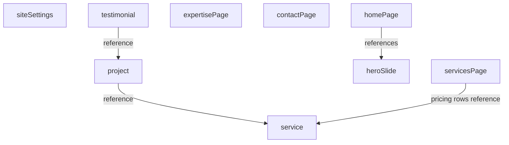

# Sanity.io Content Migration Plan

**Overview:** Migrate marketing content to Sanity.io via a portable schema + seed kit (separate Studio repo). **Prep is complete** — content lives in typed modules and all call sites go through `lib/content.ts`; the remaining work is Sanity wiring inside that single file plus seed/schema generation.

## Prep complete (current state)

Marketing content is no longer scattered across pages. The following is **done**:

| Module | Maps to Sanity | Contains |
|--------|----------------|----------|
| [apps/web/src/lib/site-settings.ts](../apps/web/src/lib/site-settings.ts) | `siteSettings` | Business facts, footer, legal links, global CTA, trust badge |
| [apps/web/src/lib/pages/home.ts](../apps/web/src/lib/pages/home.ts) | `homePage` | Hero CTAs, section copy, process steps, SEO |
| [apps/web/src/lib/hero-slides.ts](../apps/web/src/lib/hero-slides.ts) | `heroSlide` | Carousel slides |
| [apps/web/src/lib/pages/services.ts](../apps/web/src/lib/pages/services.ts) | `servicesPage` | Philosophy pillars, section headings, investment guide copy, SEO |
| [apps/web/src/lib/pages/expertise.ts](../apps/web/src/lib/pages/expertise.ts) | `expertisePage` | Pillars, stats, credentials heading, SEO |
| [apps/web/src/lib/pages/contact.ts](../apps/web/src/lib/pages/contact.ts) | `contactPage` | Hero copy, budget bands, SEO |
| [apps/web/src/lib/projects.ts](../apps/web/src/lib/projects.ts) | `project`, `service`, `testimonial` | Entities + location/serviceType taxonomies |
| [apps/web/src/lib/credentials.ts](../apps/web/src/lib/credentials.ts) | `credential` | Shared trust badges |
| [apps/web/src/lib/pricing.ts](../apps/web/src/lib/pricing.ts) | `servicesPage.pricingRows` | Guide prices keyed by service slug |
| [apps/web/src/lib/image.ts](../apps/web/src/lib/image.ts) | `imageWithAlt` | `{ src, alt }` on all images |

**Content access layer:** [apps/web/src/lib/content.ts](../apps/web/src/lib/content.ts) exposes async accessors. All marketing pages and site-wide components already `await` these — **no page or component edits are needed when Sanity arrives**.

## How Sanity fits this site

1. **The Studio** — separate repo (`npm create sanity@latest`). This monorepo ships `sanity-kit/` to copy in.
2. **The Content Lake** — GROQ via `@sanity/client` on Cloudflare Workers SSR. Public dataset reads hit Sanity's CDN.

Operational data (auth, customer portal, D1/R2) stays out of Sanity.

## Content model design

Schemas should **mirror the existing TypeScript module shapes**.

- **Repeatable documents:** `project`, `service`, `testimonial`, `heroSlide`
- **Singletons:** `siteSettings`, `homePage`, `servicesPage`, `expertisePage`, `contactPage`, `legalPage` (×2)
- **Shared objects:** `seo`, `cta`, `credential`, `pillar`, `stat`, `processStep`, `imageWithAlt`

## Remaining implementation

### 1. `sanity-kit/` — schemas + desk structure + README

Mirror shapes from the `lib/` modules listed above.

### 2. Seed content

Generate `seed.ndjson` from extracted modules with stable `_id`s (`service-garden-ponds`, `project-penzance-estate-pond`, …). Images still missing from `public/images/` — upload via Studio after import.

### 3. `lib/sanity/` — client, queries, mappers

- `@sanity/client` + `@sanity/image-url`
- GROQ queries map to existing interfaces (`SiteSettings`, `Project`, etc.)
- Env: `PUBLIC_SANITY_PROJECT_ID` / `PUBLIC_SANITY_DATASET` in [astro.config.mjs](../apps/web/astro.config.mjs), [packages/env](../packages/env/src/web.ts), [alchemy.run.ts](../packages/infra/alchemy.run.ts)

### 4. Swap `content.ts` only

Replace static returns with GROQ fetches. Pages and components unchanged.

### 5. Legal pages

Add `/privacy` and `/terms` (footer links already in `siteSettings.legalLinks`).

### 6. Cleanup

Remove static data arrays from `lib/` modules after verification. Run `pnpm --filter web exec astro check` and `pnpm --filter web build`.

## Outside this repo

1. Create Sanity project at sanity.io/manage
2. `npm create sanity@latest` in new repo; copy `sanity-kit/`
3. `sanity dataset import seed.ndjson production`; upload images
4. Add project ID/dataset to `apps/web/.env` + Studio CORS

## Task checklist

**Done (prep):**
- [x] Extract content into typed modules shaped like Sanity documents
- [x] Add `lib/content.ts` async accessors; wire all pages and site-wide components
- [x] Upgrade images to `{ src, alt }`; dedupe credentials; key pricing by service slug
- [x] Prop-drive components; stop islands importing data modules

**Remaining:**
- [ ] Create `sanity-kit/` schemas + desk structure + README
- [ ] Generate `seed.ndjson` from extracted modules
- [ ] Add `@sanity/client` + `lib/sanity/` (client, queries, mappers)
- [ ] Wire Sanity env vars through astro config, packages/env, Alchemy
- [ ] Swap `lib/content.ts` accessors to GROQ
- [ ] Add `/privacy` and `/terms` pages
- [ ] Remove static data arrays after verification
